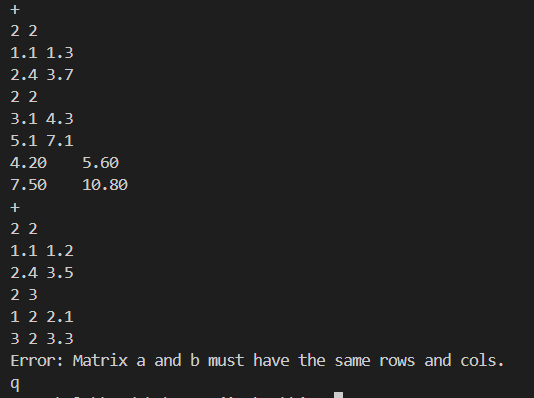

# algebra
纭欢鎶€鏈洟闃熺紪绋嬪熀纭€浣滀笟
## 璇句欢璧勬枡 | Reference
* [璇剧▼PPT](https://tannin-1316822731.cos.ap-nanjing.myqcloud.com/2025-04-19-2025%E7%A1%AC%E4%BB%B6%E7%AC%AC%E4%B8%80%E6%AC%A1%E5%86%85%E8%AE%AD.pdf)
* [VSCode鐨凜/C++鐜閰嶇疆鏁欑▼](https://www.bilibili.com/video/BV1UZ421e7ty/?share_source=copy_web&vd_source=d82c2ec75577b6834f9f580f066180c1)
* [Git浣跨敤鏁欑▼](https://www.bilibili.com/video/BV1og4y1u7XU/?share_source=copy_web&vd_source=d82c2ec75577b6834f9f580f066180c1)
## 棰勪慨瑕佹眰锝淩equirements
淇杩囥€奀绋嬪簭璁捐鍩虹銆嬨€併€婄嚎鎬т唬鏁般€嬩互鍙奨路Lab纭欢鎶€鏈洟闃熺紪绋嬪熀纭€璇剧▼鎴栧叾瀵瑰簲鐨勯珮闃惰绋嬨€�
## 璇存槑锝淓xplainations
鏈鐩殑闅惧害瀵逛簬鍒濆鑰呰€岃█鐩稿杈冮珮锛屼富瑕佽€冨療浜嗗熀纭€鐨勬暟瀛﹁兘鍔涖€侀€氳繃缂栫▼瑙ｅ喅闂鐨勮兘鍔涗互鍙婂伐绋嬬鐞嗐€丆Make銆乬it绛夌患鍚堣兘鍔涖€傝浣滀笟鐨勬渶缁堝緱鍒嗕粎浣滃弬鑰冿紝鍚屽浠彲鏍规嵁鑷繁鐨勮兘鍔涙潵鍐冲畾瀹炵幇鍝簺鍑芥暟銆�
## 棰樼洰鑳屾櫙锝淏ackground
銆婄嚎鎬т唬鏁般€嬩綔涓烘禉姹熷ぇ瀛﹀伐绉戝鏁颁笓涓氬繀淇殑鏁板鍩虹璇剧▼锛屽浜庡叾鎺屾彙鏄嚦鍏抽噸瑕佺殑锛屽悗缁悇澶т笓涓氱殑涓撲笟璇剧▼涔熼兘绂讳笉寮€绾挎€т唬鏁般€傜劧鑰岋紝鍦ㄥ悗缁殑涓撲笟璇剧▼瀛︿範涓紝鎴戜滑寰€寰€鍙渶瑕佽绠椾竴浜涚煩闃电殑鏁板€艰В锛岃繖涓繃绋嬪鏋滅敤鎵嬪幓璁＄畻鐨勮瘽鏄崄鍒嗙棝鑻︾殑銆傜鎵跨潃鈥滄垜閮藉缂栫▼浜嗗氨涓嶈鑷繁鍋氫竴浜涙棤鎰忎箟鐨勪簨鎯呪€濈殑鍘熷垯锛屾垜浠喅瀹氬疄鐜颁竴涓嚎鎬т唬鏁拌绠楀簱锛屾潵杈呭姪鎴戜滑杩涜杩愮畻銆�
> 褰撶劧锛屽MATLAB銆丳ython绛夐珮绾х紪绋嬭瑷€宸茬粡鍙互鍋氬埌杩欑被浜嬫儏锛屼笖鍋氬緱鏇村ソ锛屼絾杩欏苟涓嶅Θ纰嶆垜浠€氳繃杩欐牱涓€绉嶆柟寮忔潵閿荤偧鑷繁鐨凜璇█缂栫▼鑳藉姏銆�
## 棰樼洰浠嬬粛锝淚ntroduction
鏈粨搴撶粰鍑轰簡鎴戜滑鍦ㄥ唴璁腑鎻愬埌鐨勫伐绋嬫ā鏉匡紝鍚屽浠鍋氱殑浠诲姟濡備笅锛�
1. 鑷git锛屾敞鍐孏itHub璐﹀彿锛屽皢鏈粨搴撳湪鑷繁鐨凣itHub璐︽埛涓婩ork涓€浠斤紙娉ㄦ剰鏄疐ork锛岀姝㈢洿鎺lone鏈粨搴撳埌鏈湴锛屽惁鍒欎綘灏嗘棤娉曞畬鎴愬悗缁彁浜わ級锛屽苟鎸夌収`yourname_hw1`鐨勬牸寮忔洿鏀逛粨搴撳悕绉帮紙鍦ㄤ粨搴撲腑鐨凷ettings澶勫彲淇敼锛岃寰椾笉瑕佺敤涓枃锛屼粨搴撴潈闄愪负public锛屽娑夊強鍒伴殣绉佷繚鎶わ紝鍙涓簆rivate锛屼絾瑕佸皢`tanninrachel@yinlin.wiki`杩欎釜璐︽埛璁剧疆涓哄崗浣滆€咃級銆�
2. 灏嗕綘鐨勪粨搴揷lone鍒版湰鍦般€�
3. 鎸夌収鍐呰鎵€璁茬殑宸ョ▼妯℃澘琛ュ厖鎵€缂虹殑鏂囦欢澶广€�
4. 鏍规嵁`inc/algebra.h`涓殑娉ㄩ噴鍜岄瀹氫箟锛屽湪`src/algebra.c`涓疄鐜板搴旂殑鍑芥暟銆�
5. 鏍规嵁鍐呰鎵€璁诧紝鑷缂栧啓`CMakeLists.txt`鏂囦欢锛屼娇浣犵殑宸ョ▼鑳藉鍦ㄦ湰鍦版垚鍔熺紪璇戣繍琛屻€�
6. 鑷Markdown锛屼慨鏀筦README.md`鏂囦欢锛岄渶瑕佸寘鍚綘鐨勫疄鐜版€濊矾锛堝ぇ鑷存弿杩板嵆鍙級浠ュ強鏈湴杩愯鎴浘銆�
7. 灏嗕綘鐨勪慨鏀规彁浜ゅ埌杩滅▼浠撳簱锛屽苟灏嗕粨搴撻摼鎺ユ彁浜わ紙鎻愪氦鏂瑰紡瑙佷笅鏂囷級銆�
## 鎬濊矾鍙傝€冿綔Thinking
瑙乣doc`鏂囦欢澶广€�
## 浜や簰鏍煎紡锝淔ormat
鍦ㄦ湰棰樼洰涓紝`main.c`鏂囦欢宸茬粰鍑猴紝涓嶉渶瑕佸悓瀛︿滑鑷繁瀹炵幇锛屼篃璇蜂笉瑕佹洿鏀硅繖涓枃浠讹紝鍚﹀垯鍙兘鍑虹幇鍒ら閿欒銆�
### 杈撳叆鏍煎紡
鏈鐩噰鐢ㄥ抚鍒ゅ畾鐨勬€濊矾杩涜锛屾瘡涓€甯х殑绗竴琛屾寚浠や唬鐮侊紝`+`銆乣-`銆乣*`銆乣.`銆乣t`銆乣d`銆乣i`銆乣r`銆乣j`鍒嗗埆娴嬭瘯`add_matrix`銆乣sub_matrix`銆乣mul_matrix`銆乣scale_matrix`銆乣transpose_matrix`銆乣det_matrix`銆乣inv_matrix`銆乣rank_matrix`銆乣trace_matrix`鍑芥暟锛宍q`琛ㄧず閫€鍑恒€�

鎺ヤ笅鏉ョ殑涓€琛岃緭鍏ョ煩闃� $\mathbf{A}$ 鐨勮鏁� $m$ 鍜屽垪鏁� $n$ 锛屽湪鎺ヤ笅鏉ョ殑 $m$ 琛屼腑杈撳叆 $n$ 涓弻绮惧害娴偣鏁帮紝浠ョ┖鏍煎垎寮€銆�
瀵逛簬浜屽厓杩愮畻鍑芥暟鐨勬祴璇曪紝闇€瑕佸啀鎸夌収涓婅堪杩囩▼杈撳叆鐭╅樀 $\textbf{B}$ 銆�

鍙兘鐨勪竴娆¤繍琛岃緭鍏ュ涓嬶細
```
+
2 2
1.1 1.3
2.4 3.7
2 2
3.1 4.3
5.1 7.1
+
2 2
1.1 1.2
2.4 3.5
2 3
1 2 2.1
3 2 3.3
q
```
### 杈撳嚭鏍煎紡
鍦ㄦ瘡涓€甯т腑锛屼緷娆℃牴鎹緭鍏ョ殑鎸囦护浠ｇ爜杩愯瀵瑰簲鐨勫嚱鏁帮紝骞剁粰鍑哄嚱鏁扮殑杈撳嚭涓庢爣鍑嗗€兼瘮瀵广€備笂杩拌緭鍏ョ殑姝ｇ‘杈撳嚭濡備笅锛�
```
4.20    5.60    
7.50    10.80
Error: Matrix a and b must have the same rows and cols.
```
## 璇勫垎鏍囧噯锝淪tandard
* 鎴愬姛杩愯锛�+25鍒�
* `add_matrix`銆乣sub_matrix`銆乣mul_matrix`銆乣scale_matrix`銆乣transpose_matrix`銆乣trace_matrix`鍔熻兘姝ｅ父姣忎釜+5鍒�
* `det_matrix`銆乣inv_matrix`銆乣rank_matrix`鍔熻兘姝ｅ父鍏�+10鍒嗭紙姝ゅ涓洪檮鍔犻锛屾湁涓€瀹氶毦搴︼紝鍙€夊仛锛�
> 涓轰簡淇濊瘉棰樼洰闅惧害锛屾瘡涓嚱鏁板叿浣撶殑璇勫垎鏍囧噯涓嶄簣鍏竷銆�
## 鎻愪氦鏂瑰紡锝淪ubmit
灏嗕綘鐨勬瘡涓嚱鏁扮殑娴嬭瘯杩愯缁撴灉浠ユ埅鍥剧殑褰㈠紡鏀惧湪浣犱粨搴撶殑`README.md`鏂囦欢涓紙璇锋敞鎰廙arkdown涓浘鐗囩殑寮曠敤瑕佸寘鍚簮鏂囦欢锛夈€傚苟灏嗕綘鐨勬渶缁堜唬鐮佷粨搴撻摼鎺ワ紙鍦ㄦ祻瑙堝櫒涓婄殑閭ｄ釜锛屼笉瑕佸甫鏈塦.git`鐨勶級濉啓濡備笅闂嵎鍙戦€侊細


## 瀹炵幇鎬濊矾
* `add_matrix`锛氬垽鏂袱涓煩闃佃鍒楁槸鍚︾浉绛夛紝鍐嶉€氳繃涓や釜寰幆鐩稿姞銆�
* `sub_matrix`锛氬垽鏂袱涓煩闃佃鍒楁槸鍚︾浉绛夛紝鍐嶉€氳繃涓や釜寰幆鐩稿噺銆�
* `mul_matrix`锛氬垽鏂袱涓煩闃佃兘鍚︾浉涔橈紝鍐嶉€氳繃涓や釜寰幆閫愪釜鐩镐箻銆�
* `scale_matrix`锛氶€氳繃涓や釜寰幆杩涜鏁颁箻杩愮畻鍗冲彲銆�
* `transpose_matrix`锛氶€氳繃璋冩崲i,j瀹炵幇杞疆杩愮畻銆�
* `det_matrix`銆乣inv_matrix`銆乣rank_matrix`锛氬弬鑰冧簡thinking.md涓殑鎬濊矾銆�
* `trace_matrix`锛氬皢瀵硅绾匡紙鍗砳=j锛夊鍧囩浉鍔犲嵆鍙€�

## 鏈湴杩愯鎴浘
  
  
  
  
  
  
  
  
  

